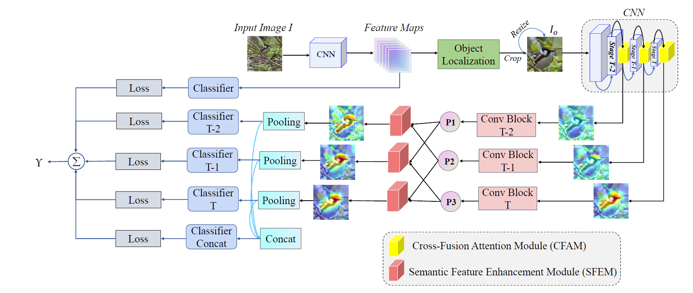

# Alleviating Category Confusion in Fine-Grained Visual Classification

---
## Introduction
It is essential for fine-grained visual classification (FGVC) tasks to explore and mine subtle and unique 
features between visually similar sub-categories. Most existing methods are dedicated to extracting
more discriminative features or as many different features as possible to improve classification
performance. However, there has been insufficient research into addressing misclassification (category
confusion) issues between visually similar categories. In this paper, we propose an improved crossentropy
(ICE) loss function to avoid classification errors by recalculating the probability distribution
of the top-k categories. In addition, we propose two modules to improve performance, a generic Object
Localization Module (OLM) that incorporates the connectivity component algorithm to acquire object
instances, and a Cross-Fusion Attention Module (CFAM) to model spatial long-range dependencies.




## Dataset
In this paper, we use 3 large datasets to evaluate performance:

CUB-200-2011: https://www.vision.caltech.edu/datasets/cub_200_2011/

Stanford Cars: http://ai.stanford.edu/~jkrause/cars/car_dataset.html

FGVC-Aircraft: https://www.robots.ox.ac.uk/~vgg/data/fgvc-aircraft/

## Requirement

python 3.6.5

PyTorch >= 1.2.0

torchvision >= 0.4.0
## Training

multi-gpu training you should Call the `gpu` in the [config](config.py) to file and set the corresponding gpu,
and you can change other hyper-parameters in the [config](config.py) 
```shell
python trian.py
```


